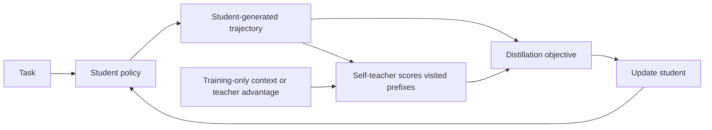

# Awesome OPSD

**A curated reading list of on-policy self-distillation for language models and agents.**

  

Papers, code, and concise method annotations covering self-teacher construction, privileged context, reasoning stability, label-free learning, and multi-turn agents. Related OPD and harness work is labeled separately.

**Current coverage:** 54 papers, including 53 first submitted from **2026-04-06 through 2026-10-06**, plus the original OPSD paper as earlier background. Dates refer to the **first arXiv submission**, not the latest revision or conference appearance.

[Paper data](data/papers.json) · [BibTeX](papers.bib) · [Contributing](CONTRIBUTING.md)

## What is OPSD?

In on-policy self-distillation, a student generates training trajectories and a teacher derived from the same model supervises those trajectories. The teacher often receives additional context, such as a solution, feedback, or a skill, while the student learns to act without that context. The teacher can be frozen, synchronized, averaged, or separately adapted; “self” does not require identical live weights at every update. See the [original formulation](https://arxiv.org/abs/2601.18734).

This diagram describes the common privileged-context recipe. Some listed methods also use RL rewards, intervene in trajectory generation, or align hidden states and attention. Their annotations state those differences.

## Contents

- [Suggested reading paths](#suggested-reading-paths)
- [Foundations and overviews](#foundations-and-overviews) (2)
- [Self-teacher design](#self-teacher-design) (8)
- [Objectives, reliability, and diagnostics](#objectives-reliability-and-diagnostics) (16)
- [Unsupervised and self-generated supervision](#unsupervised-and-self-generated-supervision) (5)
- [Agents, skills, and harness self-distillation](#agents-skills-and-harness-self-distillation) (9)
- [Attention, representations, and latent context](#attention-representations-and-latent-context) (3)
- [Context and domain extensions](#context-and-domain-extensions) (4)
- [Related OPD and harness work](#related-opd-and-harness-work) (7)
- [Curation notes](#curation-notes)

## Suggested reading paths

| Question | Reading path |
| --- | --- |
| How does OPSD work, and what does privilege add? | [OPSD / Self-Distilled Reasoner](https://arxiv.org/abs/2601.18734) → [OP²SD](https://arxiv.org/abs/2608.09228) → [What Does Privileged Information Add?](https://arxiv.org/abs/2609.20612) |
| Why can reasoning degrade? | [Rethinking OPSD for Thinking Models](https://arxiv.org/abs/2607.05184) → [Purified OPSD](https://arxiv.org/abs/2607.02234) → [RLCSD](https://arxiv.org/abs/2606.11709) → [SIPO](https://arxiv.org/abs/2609.36742) |
| Can it work without gold answers? | [U-OPSD](https://arxiv.org/abs/2608.06296) → [CoDA](https://arxiv.org/abs/2608.08764) → [TTPO](https://arxiv.org/abs/2608.27448) |
| Can the teacher improve with the student? | [DualOPSD](https://arxiv.org/abs/2608.26019) → [B-OPSD](https://arxiv.org/abs/2609.37132) → [RISE](https://arxiv.org/abs/2609.05295) |
| How does it extend to agents? | [Skill-SD](https://arxiv.org/abs/2604.10674) → [OPID](https://arxiv.org/abs/2606.26790) → [HERO](https://arxiv.org/abs/2606.11559) → [AgentOPSD](https://arxiv.org/abs/2608.05987) → [RetireOPD](https://arxiv.org/abs/2609.20784) |
| What can be transferred besides token probabilities? | [LOPD](https://arxiv.org/abs/2608.13040) → [PR-OPD](https://arxiv.org/abs/2609.36642) → [OPASD](https://arxiv.org/abs/2609.33200) |

Reading order is a navigation aid, not a benchmark ranking. In the tables, a dash in the code column means no reachable author-associated repository was identified during curation; it does not establish that no implementation exists.

## Foundations and overviews

The original OPSD formulation and a short orientation reference. Foundational work can predate the recent coverage window.

| First submitted | Paper | Method / connection | Code |
| --- | --- | --- | --- |
| 2026-05-18 | **Brief OPSD Overview** [A Brief Overview: On-Policy Self-Distillation In Large Language Models](https://arxiv.org/abs/2605.18141) · [PDF](https://arxiv.org/pdf/2605.18141) | An introductory overview of the OPSD setup and design choices. Included as an orientation reference, not as a new algorithm or independent experimental validation of the original OPSD claims. | — |
| 2026-01-26 | **OPSD / Self-Distilled Reasoner** [Self-Distilled Reasoner: On-Policy Self-Distillation for Large Language Models](https://arxiv.org/abs/2601.18734) · [PDF](https://arxiv.org/pdf/2601.18734) | A problem-only student learns on its own rollouts from a self-teacher given a verified solution. The released main recipe uses a frozen base teacher and pointwise clipping. Foundational background first submitted before the recent coverage window. | [Code](https://github.com/siyan-zhao/OPSD) |

## Self-teacher design

Where does the teacher advantage come from: context, temperature, adaptation, extrapolation, or future optimization progress?

| First submitted | Paper | Method / connection | Code |
| --- | --- | --- | --- |
| 2026-09-29 | **B-OPSD** [Train Ahead, Distill Back: Bootstrapping On-Policy Self-Distillation for Large Language Models](https://arxiv.org/abs/2609.37132) · [PDF](https://arxiv.org/pdf/2609.37132) | Temporarily trains ahead to obtain a future teacher, freezes it, restarts the student, and distills on the restarted student's trajectories. Studies both answer-available and answer-free pathways; the lookahead stage adds training work that belongs in cost comparisons. | — |
| 2026-09-25 | **TISD** [TISD: On-Policy Self-Distillation with Trajectory Intervention](https://arxiv.org/abs/2609.30878) · [PDF](https://arxiv.org/pdf/2609.30878) | Uses teacher disagreement to choose a branch token, forces that action, and returns suffix generation to the student before distillation. It changes the visited training states, not just the weight assigned to existing tokens; include regeneration cost in comparisons. | [Code](https://github.com/taeckyung/TISD) |
| 2026-09-17 | **What Does Privileged Information Add?** [What Does Privileged Information Add to On-Policy Self-Distillation?](https://arxiv.org/abs/2609.20612) · [PDF](https://arxiv.org/pdf/2609.20612) | Uses matched reference-free and six-view controls to separate distillation gains from the marginal benefit of privileged references. Highlights dependence on training and evaluation reasoning modes, directly complementing the OP²SD intervention. | [Code](https://github.com/xiuyuz/opsd-reference-study) |
| 2026-09-04 | **RISE** [RISE: Recursive Improvement via Self-Extrapolating Policy Distillation](https://arxiv.org/abs/2609.05295) · [PDF](https://arxiv.org/pdf/2609.05295) | Extrapolates the model's own RLVR progress in weights or logits to synthesize an improving teacher. Removes privileged-context dependence while retaining outcome supervision. Compare with B-OPSD's explicitly trained future teacher and restarted student. | — |
| 2026-08-26 | **DualOPSD** [DualOPSD: Adaptive Privileged Teachers for On-Policy Self-Distillation](https://arxiv.org/abs/2608.26019) · [PDF](https://arxiv.org/pdf/2608.26019) | Alternates student learning with teacher adaptation on the same rollout. Its own limitations report scale-dependent accuracy effects, one training seed, and a reversal at 1.7B; reduced teacher-student KL is not by itself evidence of better reasoning. | — |
| 2026-08-10 | **OP²SD** [Privileged Solutions or Context-Induced Teacher Behavior? Dissecting On-Policy Self-Distillation](https://arxiv.org/abs/2608.09228) · [PDF](https://arxiv.org/pdf/2608.09228) | Replaces the paired solution with a worked example from another problem while preserving the OPSD training setup. Tests whether gains require target-specific answers or can arise from teacher behavior induced by context; arbitrary context is not established as equally useful. | [Code](https://github.com/MBZUAI-reasoninglab/OP2SD) |
| 2026-05-30 | **TS-OPSD / Policy Reheater** [Internalize the Temperature: On-Policy Self-Distillation as Policy Reheater for Reinforcement Learning](https://arxiv.org/abs/2606.00755) · [PDF](https://arxiv.org/pdf/2606.00755) | Distills a temperature-smoothed copy of an entropy-collapsed policy back into itself before continuing RL. Its teacher advantage is a distribution transformation, not a privileged answer; the metadata first-submission date is May 30 despite the June arXiv identifier. | — |
| 2026-05-20 | **AVSD** [AVSD: Adaptive-View Self-Distillation by Balancing Consensus and Teacher-Specific Privileged Signals](https://arxiv.org/abs/2605.20643) · [PDF](https://arxiv.org/pdf/2605.20643) | Combines multiple privileged views by separating their shared signal from view-specific residuals. Residuals contribute only when aligned with the consensus, offering a different answer to teacher inconsistency than using a single richer context. | [Code](https://github.com/duykhuongnguyen/AVSD) |

## Objectives, reliability, and diagnostics

Which teacher corrections transfer, how should they be weighted, and when does self-distillation damage reasoning or retention? Diagnostic findings are scoped to each paper's settings.

| First submitted | Paper | Method / connection | Code |
| --- | --- | --- | --- |
| 2026-10-04 | **OG-OPSD** [Outcome-Guided On-Policy Self-Distillation](https://arxiv.org/abs/2610.05070) · [PDF](https://arxiv.org/pdf/2610.05070) | Uses forward KL on complete correct trajectories and reverse KL on selected prefixes of incorrect ones. Cumulative teacher entropy helps choose the supervised prefix, connecting outcome correctness to both objective and token selection. | — |
| 2026-09-29 | **SIPO** [SIPO: Unifying Reinforcement Learning with On-Policy Self-Distillation](https://arxiv.org/abs/2609.36742) · [PDF](https://arxiv.org/pdf/2609.36742) | Contrasts teacher contexts built from a reference answer and rollout-group mistakes to obtain dense token credit while retaining task-reward optimization. Especially close to RLCSD; unlike purely group-relative outcome advantages, it can provide a signal in all-failure groups. | [Code](https://github.com/Yueeeeeeee/SIPO) |
| 2026-08-14 | **ICSD** [Trust Is Not Enough: Influence Calibration for On-Policy Self-Distillation in Agentic RL](https://arxiv.org/abs/2608.14945) · [PDF](https://arxiv.org/pdf/2608.14945) | Weights privileged self-distillation by its estimated compatibility with the current RL objective, while preserving auxiliary-loss mass within each turn. Teacher confidence alone is treated as insufficient evidence that an update will help the task. | [Code](https://github.com/lanqz7766/Influence-Calibration-for-On-Policy-Self-Distillation-in-Agentic-RL) |
| 2026-08-10 | **SR-OPSD** [SR-OPSD: Self-Referenced On-Policy Self-Distillation](https://arxiv.org/abs/2608.09745) · [PDF](https://arxiv.org/pdf/2608.09745) | Combines a geometric target anchored to the frozen initial policy with forward Rényi projection. Target construction and projection interact; its fixed-context analysis does not establish stability of the entire evolving training process. | — |
| 2026-07-30 | **β-OPSD** [β-OPSD: Deriving with Policy Optimization, Training with Self-Distillation](https://arxiv.org/abs/2607.28582) · [PDF](https://arxiv.org/pdf/2607.28582) | Derives a KL-regularized policy-optimization family and realizes its target through reference-teacher logit interpolation. Adds explicit reference strength and return-to-go credit; closely related to SR-OPSD's target-construction question. | — |
| 2026-07-12 | **AD-OPSD / Thinking Collapse** [Diagnosing and Mitigating Thinking Collapse in On-Policy Self-Distillation](https://arxiv.org/abs/2607.10805) · [PDF](https://arxiv.org/pdf/2607.10805) | Diagnoses suppression of epistemic tokens at uncertain decision forks and selectively anchors risky updates to a frozen base prior. Provides a targeted safeguard to compare against clipping, PMI purification, and entropy routing. | — |
| 2026-07-06 | **Rethinking OPSD for Thinking Models** [Rethinking On-Policy Self-Distillation for Thinking Models](https://arxiv.org/abs/2607.05184) · [PDF](https://arxiv.org/pdf/2607.05184) | Reports degradation in five thinking models and examines suppressed self-correction at high-entropy branching points. Essential context for interpreting gains obtained with non-thinking training and thinking-enabled evaluation. | [Code](https://github.com/princeton-pli/rethinking-opsd-for-thinking-models) |
| 2026-07-02 | **Purified OPSD** [Purified OPSD: On-Policy Self-Distillation Without Losing How to Think](https://arxiv.org/abs/2607.02234) · [PDF](https://arxiv.org/pdf/2607.02234) | Uses a reference-only teacher to estimate the shortcut component of privileged supervision, then forms a PMI-based residual target anchored to a clean base distribution. Closely related to RLCSD's attempt to separate useful corrections from context-induced style changes. | — |
| 2026-07-02 | **Denser ≠ Better** [Denser ≠ Better: Limits of On-Policy Self-Distillation for Continual Post-Training](https://arxiv.org/abs/2607.01763) · [PDF](https://arxiv.org/pdf/2607.01763) | Tests SDPO in continual post-training and links failures to teacher instability, drift, and reinforced artifacts. On-policy data and dense feedback do not automatically prevent forgetting; conclusions are scoped to the evaluated protocols. | [Code](https://github.com/Moenupa/SDPO-CL) |
| 2026-06-24 | **Sampled Demonstrations & Diversity** [On-Policy Self-Distillation with Sampled Demonstrations Reduces Output Diversity](https://arxiv.org/abs/2606.26091) · [PDF](https://arxiv.org/pdf/2606.26091) | Analyzes how conditioning on sampled correct demonstrations can compound existing mode preferences. Graph path-finding and science QA experiments motivate evaluating pass@k and functional diversity alongside average success. | — |
| 2026-06-10 | **RLCSD** [RLCSD: Reinforcement Learning with Contrastive On-Policy Self-Distillation](https://arxiv.org/abs/2606.11709) · [PDF](https://arxiv.org/pdf/2606.11709) | Contrasts correct-hint and wrong-hint teacher signals to reduce privilege-induced style drift, then uses the contrast for verifier-grounded credit modulation. This is a close companion to SIPO and the thinking-collapse diagnostics. | [Code](https://github.com/THU-BPM/RLCSD) |
| 2026-05-27 | **ROSD** [Beyond Imitation: Reflective On-Policy Self-Distillation for LLM Reasoning](https://arxiv.org/abs/2605.28014) · [PDF](https://arxiv.org/pdf/2605.28014) | A self-reflector contrasts successful and failed rollouts, extracts a corrective idea, and locates the first erroneous sentence. Distillation skips the valid prefix of diagnosed failures, targeting correction while seeking to preserve reasoning diversity. | [Code](https://github.com/ZiqiZhao1/ROSD) |
| 2026-05-21 | **DASD** [Tailoring Teaching to Aptitude: Direction-Adaptive Self-Distillation for LLM Reasoning](https://arxiv.org/abs/2605.22263) · [PDF](https://arxiv.org/pdf/2605.22263) | Routes the direction of teacher supervision by token entropy: attraction at low entropy and repulsion at high entropy. A more interventionist response to lost exploration than merely clipping or downweighting teacher signals. | — |
| 2026-05-20 | **PW-OPSD** [When Are Teacher Tokens Reliable? Position-Weighted On-Policy Self-Distillation for Reasoning](https://arxiv.org/abs/2605.21606) · [PDF](https://arxiv.org/pdf/2605.21606) | A branch-viability diagnostic motivates increasing token-position weights while retaining OPSD's rollout and clipped forward-KL target. The reported local uncertainty predictors are weak in its diagnostic, making it an important comparison for entropy-based recipes. | [Code](https://github.com/SaFo-Lab/PW-OPSD) |
| 2026-05-13 | **EGRSD / CL-EGRSD** [Respecting Self-Uncertainty in On-Policy Self-Distillation for Efficient LLM Reasoning](https://arxiv.org/abs/2605.13255) · [PDF](https://arxiv.org/pdf/2605.13255) | Combines reward-grounded update direction, likelihood-ratio magnitude, and a teacher-entropy confidence gate. The lookahead variant distinguishes persistent uncertainty from uncertainty that resolves quickly. Compare with position-based weighting rather than assuming entropy is universally reliable. | — |
| 2026-05-11 | **The Many Faces of OPD** [The Many Faces of On-Policy Distillation: Pitfalls, Mechanisms, and Fixes](https://arxiv.org/abs/2605.11182) · [PDF](https://arxiv.org/pdf/2605.11182) | Studies teacher-student mismatch, biased TopK reverse-KL gradients, and the distinction between transferable shared rules and instance-specific privileged information. A diagnostic companion to positive OPSD results, rather than evidence that every OPSD recipe fails. | — |

## Unsupervised and self-generated supervision

Consensus, retrieval, and the model's own attempts supply training signals. Self-generated does not always mean label-free: SSOPD still uses a correctness verifier.

| First submitted | Paper | Method / connection | Code |
| --- | --- | --- | --- |
| 2026-09-29 | **InFlow** [Know Thyself, Teach Thyself: Internal Information Flow for Selective Self-Distillation](https://arxiv.org/abs/2609.36695) · [PDF](https://arxiv.org/pdf/2609.36695) | Retrieves useful sources from calibrated hidden-state trajectories, then selects examples by the change in teacher answer beliefs after retrieval. Connects retrieval quality and sample selection to on-policy distillation without gold labels or a stronger teacher. | [Code](https://github.com/1240148048/INFLOW) |
| 2026-08-27 | **TTPO** [TTPO: Test-Time Policy Optimization](https://arxiv.org/abs/2608.27448) · [PDF](https://arxiv.org/pdf/2608.27448) | Routes majority-agreeing rollouts to distillation and disagreeing rollouts to a grouped-RL penalty, with token selection in both branches. Particularly relevant to label-free test-time adaptation, whose evaluation protocol differs from ordinary held-out post-training. | [Code](https://github.com/ZJU-REAL/TTPO) |
| 2026-08-09 | **CoDA** [Learning from Consensus and Disagreement: Unsupervised On-Policy Self-Distillation with Minority-Trajectory Contrast](https://arxiv.org/abs/2608.08764) · [PDF](https://arxiv.org/pdf/2608.08764) | Uses answer consensus to condition a self-teacher and adds reference-anchored, KTO-style calibration of minority trajectories. Unlike U-OPSD's correction of disagreeing completions, it also collects fresh student trajectories for distribution alignment. | — |
| 2026-08-06 | **U-OPSD** [On-Policy Self-Distillation without Any Supervision](https://arxiv.org/abs/2608.06296) · [PDF](https://arxiv.org/pdf/2608.06296) | Builds a pseudo-reference from majority agreement and distills along disagreeing completions, without gold answers or an external teacher. The paper's limitations emphasize canonicalizable answers, base-model competence, and smaller gains in thinking mode. | [Code](https://github.com/williamium3000/u-opsd) |
| 2026-05-17 | **SSOPD** [Self-Supervised On-Policy Distillation for Reasoning Language Models](https://arxiv.org/abs/2605.17497) · [PDF](https://arxiv.org/pdf/2605.17497) | Uses the shortest verified-correct and longest incorrect completion in a rollout group for dense correction. It avoids external solution traces, but still needs correctness verification; this separates it from fully label-free U-OPSD and CoDA. | — |

## Agents, skills, and harness self-distillation

Training-time skills, reflection, harnesses, and environment feedback provide privileged guidance for student-generated interactions.

| First submitted | Paper | Method / connection | Code |
| --- | --- | --- | --- |
| 2026-09-23 | **GUI-SD-v2** [Learn How to Act from Your Own Interactions: On-Policy Self-Distillation for GUI Agents](https://arxiv.org/abs/2609.27307) · [PDF](https://arxiv.org/pdf/2609.27307) | First improves privilege-following ability, then selectively distills step-specific reasoning and memory guidance for multi-turn GUI agents. Extends teacher-quality and temporal-credit questions to GUI interaction. | — |
| 2026-09-17 | **RetireOPD** [RetireOPD: Self-Retiring On-Policy Distillation for Agentic Reinforcement Learning](https://arxiv.org/abs/2609.20784) · [PDF](https://arxiv.org/pdf/2609.20784) | Trains a skill-conditioned teacher, jointly trains the skill-free student with RL and distillation, then retires the teacher when transfer stalls and the student reaches a competence threshold. Adds a training-stage perspective to teacher quality. | [Code](https://github.com/ZJU-REAL/SDAR) |
| 2026-08-06 | **AgentOPSD** [AgentOPSD: Recursive Self-Distillation for Agentic Reinforcement Learning](https://arxiv.org/abs/2608.05987) · [PDF](https://arxiv.org/pdf/2608.05987) | Aggregates token-level teacher-student gaps into turn evidence and recursively updates a success-belief proxy. The resulting weights refine temporal credit without a learned critic; the Bayesian interpretation uses a computable proxy for unavailable outcome-conditioned policies. | [Code](https://github.com/ZethWang/AgentOPSD) |
| 2026-07-30 | **GRSD** [Group-Reflective Self-Distillation for Agentic Reinforcement Learning](https://arxiv.org/abs/2607.28076) · [PDF](https://arxiv.org/pdf/2607.28076) | Contrasts the policy's reflections on successful and failed rollouts to construct group-level guidance. It redistributes trajectory advantages across turns while preserving the verifier-determined update direction. | [Code](https://github.com/BinbZheng1/GRSD) |
| 2026-07-16 | **SEED** [SEED: Self-Evolving On-Policy Distillation for Agentic Reinforcement Learning](https://arxiv.org/abs/2607.14777) · [PDF](https://arxiv.org/pdf/2607.14777) | First teaches the policy to produce hindsight skills, then uses the improving policy as both actor and skill analyzer during joint RL and distillation. Its initial skill-training stage should be distinguished from a method that needs no external supervision at any stage. | [Code](https://github.com/jinyangwu/SEED) |
| 2026-06-25 | **OPID** [OPID: On-Policy Skill Distillation for Agentic Reinforcement Learning](https://arxiv.org/abs/2606.26790) · [PDF](https://arxiv.org/pdf/2606.26790) | Extracts episode-level and critical-step hindsight skills from completed on-policy trajectories. Re-scoring the original responses with those skills supplies a dense auxiliary advantage alongside outcome-based RL. | [Code](https://github.com/jinyangwu/OPID) |
| 2026-06-10 | **HERO** [HERO: Hindsight-Enhanced Reflection from Environment Observations for Agentic Self-Distillation](https://arxiv.org/abs/2606.11559) · [PDF](https://arxiv.org/pdf/2606.11559) | Compresses completed interactions into local hindsight diagnoses grounded in the next environment observation. Re-scores original action tokens with turn-specific hints, addressing the mismatch between whole-trajectory feedback and the agent's local decision. | — |
| 2026-05-09 | **OPHSD** [Training with Harnesses: On-Policy Harness Self-Distillation for Complex Reasoning](https://arxiv.org/abs/2605.08741) · [PDF](https://arxiv.org/pdf/2605.08741) | Uses a harness-augmented self-teacher to internalize draft-verify and plan-solve workflows. Distinguish this from keeping a harness at deployment: the evaluated goal is to retain its benefits in the standalone model, with evidence limited to the tested harnesses. | [Code](https://github.com/zzy1127/OPHSD-On-Policy-Harness-Self-Distillation) |
| 2026-04-12 | **Skill-SD** [Skill-SD: Skill-Conditioned Self-Distillation for Multi-turn LLM Agents](https://arxiv.org/abs/2604.10674) · [PDF](https://arxiv.org/pdf/2604.10674) | Teacher-only natural-language skills summarize previous trajectories, with importance-weighted reverse KL and teacher synchronization for stability. A baseline for studying hindsight skills in multi-turn agents. | — |

## Attention, representations, and latent context

Extensions that learn privileged context or transfer internal information beyond next-token probabilities.

| First submitted | Paper | Method / connection | Code |
| --- | --- | --- | --- |
| 2026-09-29 | **PR-OPD** [PR-OPD: Privileged Representation On-policy Self-Distillation for Agentic Reinforcement Learning](https://arxiv.org/abs/2609.36642) · [PDF](https://arxiv.org/pdf/2609.36642) | After an RL warm start, the model writes hindsight skills and aligns projected student hidden states with its privileged teacher. This tests whether useful guidance resides in representations even when token probabilities barely change. | [Code](https://github.com/balibata/PR-OPD) |
| 2026-09-27 | **OPASD** [Teach Yourself Where to Look: On-Policy Attention Self-Distillation for Reasoning](https://arxiv.org/abs/2609.33200) · [PDF](https://arxiv.org/pdf/2609.33200) | Adds attention supervision to token matching, projecting the privileged teacher's attention onto positions visible to the student before normalization. A direct complement to PR-OPD's hidden-state alignment and LOPD's learned privileged context. | — |
| 2026-08-13 | **LOPD** [Latent On-Policy Self-Distillation](https://arxiv.org/abs/2608.13040) · [PDF](https://arxiv.org/pdf/2608.13040) | Learns continuous privileged context from retrieved experiences rather than prescribing a natural-language skill format. A privilege-margin constraint prevents the teacher advantage from collapsing during context learning. | [Code](https://github.com/bingreeky/LOPD) |

## Context and domain extensions

Long context, evolving contexts, diffusion language models, and solver-informed applications. Scope labels distinguish broader context distillation.

| First submitted | Paper | Method / connection | Code |
| --- | --- | --- | --- |
| 2026-09-09 | **SOLID** [Beyond Verified Answers: Solver-Informed Self-Distillation for Bootstrapping Operations Research Language Models](https://arxiv.org/abs/2609.09957) · [PDF](https://arxiv.org/pdf/2609.09957) | Uses solver artifacts and majority groups of executed candidate programs as pseudo-references for operations-research formulations. Connects label-free reference construction to a domain with executable feedback; it is not supervision-free in the sense of having no environment. | [Code](https://github.com/AIOR-Research/SOLID) |
| 2026-07-30 | **Flux-OPD** [Flux-OPD: On-Policy Distillation with Evolving Contexts](https://arxiv.org/abs/2607.28022) · [PDF](https://arxiv.org/pdf/2607.28022) | Handles evolving contexts using an anchored contextual difference signal and conflict-dependent weighting. A useful extension for open-ended tasks where a fixed privileged context becomes stale; broader context distillation rather than only answer-conditioned OPSD. | — |
| 2026-07-05 | **dOPSD** [dOPSD: On-Policy Self-Distillation for Diffusion Language Models](https://arxiv.org/abs/2607.04428) · [PDF](https://arxiv.org/pdf/2607.04428) | Constructs the teacher's privilege from a later, more decoded state of the student's own diffusion trajectory. Extends the self-teaching idea beyond autoregressive LMs without relying on an externally supplied solution. | [Code](https://github.com/tuandattt/dOPSD) |
| 2026-04-19 | **OPSDL** [OPSDL: On-Policy Self-Distillation for Long-Context Language Models](https://arxiv.org/abs/2604.17535) · [PDF](https://arxiv.org/pdf/2604.17535) | Uses a short, relevant context as the self-teacher for responses generated from the full long context. Dense log-probability-ratio feedback transfers short-context competence into long-context behavior. Relevant evidence must be preserved when constructing the short context. | — |

## Related OPD and harness work

Useful comparisons that do not share the complete OPSD setup. This section includes external-teacher OPD, offline approximations, harness search, and harness-guided SFT.

| First submitted | Paper | Method / connection | Code |
| --- | --- | --- | --- |
| 2026-10-02 | **HAD** [Harness-Aware Distillation for Small Language Model Agents](https://arxiv.org/abs/2610.02858) · [PDF](https://arxiv.org/pdf/2610.02858) | Distills a larger teacher into a smaller agent that retains the same harness. Adds an action preference from teacher responses with versus without harness information and rejects invalid preferences. Its deployment premise differs from removing the harness. | — |
| 2026-09-21 | **Harness-Zero** [Harness-Zero: Harness Distillation via Agent-as-Harness](https://arxiv.org/abs/2609.24974) · [PDF](https://arxiv.org/pdf/2609.24974) | A harnessing agent reviews and corrects student proposals to collect trajectories, followed by SFT. It transfers behavior from an evolved harness to a fixed target harness, rather than matching privileged teacher token distributions in an OPSD loop. | [Code](https://github.com/metaevo-ai/harness-zero) |
| 2026-07-29 | **DREvo** [DREvo: Distilling Recalibrated Historical Experience for Harness Self-Evolution](https://arxiv.org/abs/2607.26722) · [PDF](https://arxiv.org/pdf/2607.26722) | Reassesses historical evidence and turns it into search guidance for harness changes. The optimized artifact is the harness, so its use of 'distillation' should not be confused with OPSD updates to model weights. | — |
| 2026-07-15 | **Demystifying OPD** [Demystifying On-Policy Distillation: Roles, Pathologies, and Regulations](https://arxiv.org/abs/2607.13399) · [PDF](https://arxiv.org/pdf/2607.13399) | Studies teacher-student mismatch and length exploitation in OPD, with clipping and log-scale compression as signal controls. Relevant to OPSD implementation and evaluation, but broader external-teacher findings should not be assumed to transfer unchanged. | — |
| 2026-06-08 | **Self-Harness** [Self-Harness: Harnesses That Improve Themselves](https://arxiv.org/abs/2606.09498) · [PDF](https://arxiv.org/pdf/2606.09498) | Improves the external harness through weakness mining, candidate edits, and regression-based acceptance while keeping model weights fixed. It can supply better training scaffolds, but does not itself perform token-level on-policy self-distillation. | — |
| 2026-05-02 | **MAD-OPD** [MAD-OPD: Breaking the Ceiling in On-Policy Distillation via Multi-Agent Debate](https://arxiv.org/abs/2605.01347) · [PDF](https://arxiv.org/pdf/2605.01347) | Multiple external teachers debate the student's current state and provide confidence-weighted supervision. A useful teacher-construction comparison, but it is multi-teacher OPD rather than the single-model OPSD setting. | [Code](https://github.com/chiefovoavicii/MAD-OPD) |
| 2026-04-14 | **Lightning OPD** [Lightning OPD: Efficient Post-Training for Large Reasoning Models with Offline On-Policy Distillation](https://arxiv.org/abs/2604.13010) · [PDF](https://arxiv.org/pdf/2604.13010) | Precomputes teacher scores over SFT rollouts and reuses them under a teacher-consistency condition. Useful for reducing distillation infrastructure cost, but it is an offline approximation to external-teacher OPD, not a new self-teacher mechanism. | [Code](https://github.com/jet-ai-projects/Lightning-OPD) |

## Curation notes

- **Primary sources:** titles and dates are checked against arXiv records. Paper links lead to the source and version history.
- **Scope:** direct OPSD methods, diagnostics, and useful adjacent methods are distinguished. Harness optimization, external-teacher OPD, and supervised trajectory imitation are not treated as equivalent to OPSD.
- **Supervision:** “self-generated” and “unsupervised” are different claims. Verifiers, environment feedback, solver outputs, and training-stage teacher construction can supply additional information.
- **Evidence:** annotations summarize the papers rather than independently reproduced results. Model family, reasoning mode, training budget, and evaluation protocol can change conclusions. This is a curated reading list, not an exhaustive systematic review.
- **Reading coverage:** `coverage` in [the data](data/papers.json) distinguishes targeted full-text reading from abstract screening. Neither label implies a complete proof audit or experimental reproduction.
- **Code links:** 28 public repositories were reachable when checked on 2026-10-06; implementations were not all executed or audited.
- **Maintenance:** edit `data/papers.json`, then run `python3 scripts/build_readme.py` to regenerate this README and the bibliography.

## Acknowledgment

Inspired by the organization of [thinkwee/AwesomeOPD](https://github.com/thinkwee/AwesomeOPD). This list focuses on self-distillation and uses its own annotations. All paper and implementation credit belongs to the respective authors.

Suggestions and corrections are welcome through issues or pull requests. See [CONTRIBUTING.md](CONTRIBUTING.md).
